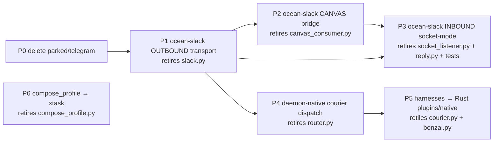

# Python → Rust Migration Plan (ocean-agents)

> Companion to [`AGENT_FILESYSTEM_ARCHITECTURE.md`](./AGENT_FILESYSTEM_ARCHITECTURE.md).
> The "agent as a file system" direction makes `ocean-agents` a **pure-content**
> repo (manifests + profiles + skills, zero executable code) and moves every
> executable into `ocean-os` as typed Rust.
>
> **Status:** plan, 2026-06-25. Grounded in source — every "already Rust" claim
> cites a real crate/file. This is a sequenced **cutover**, not a sweep: each
> piece is built in Rust, callers migrated, then the Python deleted. No deletion
> before a verified replacement.

---

## 0. The decisive finding

`ocean-os` was built with an **intentional seam** for Slack:

- **Rust owns the typed vocabulary + pending/fulfilled store.** `ocean-agent-sdk::slack_canvas`
  (`SlackCanvasOp` create/read/update/append/list, `SlackCanvasResult`, `CanvasFetchStatus`,
  `CanvasEditMode`), `ocean-runtime::tools::slack_canvas::SlackCanvasTool` (returns honest
  *pending* results, emits `ToolSideEffect::SlackCanvas`), the process-global
  `CANVAS_FULFILLMENT_REGISTRY`, and the daemon's `POST /v1/agent/canvas/fulfill` +
  `GET` query (OCEAN-235/262/271). Surface handling: `client_type: surface-slack` →
  SLACK surface, `slack_surface_prompt`, profile load from `assistants/SLACK/system.md`.
- **The actual Slack HTTP I/O was externalized to "the ocean-agents bridge."** That
  externalized half is **the Python we're migrating.** It is not accidental glue — it
  is the unbuilt other half of a half-shipped feature.

So the migration is not "rewrite glue." It is: **close the seam by building the missing
`ocean-slack` crate in `ocean-os`** (the same shape as `ocean-call`, `ocean-browser`,
`ocean-acp`, `ocean-mcp` — an integration crate), after which `ocean-agents` has no code.

---

## 1. End-state

| Repo | After migration |
|---|---|
| **ocean-os** | + new `ocean-slack` crate (inbound socket-mode + outbound transport + canvas bridge); daemon-native courier/agent dispatch (extends `agentdir.rs`) |
| **ocean-agents** | **pure content**: `courier.toml`/`content-agent.toml` manifests, `system.md` surface profiles, `SKILL.md`/`skill.yaml`. No `.py`, no `bin/`, no harness code |
| **ocean-bedrock** | unchanged (shared knowledge + workflow specs) |
| **ocean-surface** | unchanged (view) |

---

## 2. Inventory — 11 Python files (~3,131 LOC), all git-tracked

| File | Role | Retired by phase |
|---|---|---|
| `couriers/transport/slack.py` | outbound Slack HTTP (auth/post/upload/canvas/link-parse) | **P1** |
| `assistants/bridge/canvas_consumer.py` | consumes `SlackCanvas` SSE → Slack API → `POST /canvas/fulfill` | **P2** |
| `assistants/bridge/socket_listener.py` | inbound Socket Mode → daemon turn dispatch | **P3** |
| `assistants/bridge/reply.py` | daemon output → Slack thread/DM | **P3** |
| `couriers/hub/router.py` | slash→courier dispatch + hardened `call_daemon`/`session_id_for`/`extract_reply` | **P4** |
| `couriers/file-courier/harness/courier.py` | `/ship /say /resolve` | **P5** |
| `assistants/bonzai/harness/bonzai.py` | git-hygiene harness | **P5** |
| `assistants/bridge/tests/test_*.py` (×2) | bridge unit tests | **P3** (replaced by Rust tests) |
| `assistants/tools/compose_profile.py` | profile composer (build tool) | **P6** (optional) |
| `couriers/transport/parked/telegram.py` | parked, unused | **P0** (delete now) |

---

## 3. Cutover rule (inviolable)

For each phase: **build Rust → migrate every caller → verify → delete Python.**
No file in column "Retired by phase N" is removed until phase N's Rust replacement is
verified live. A phase may ship its Rust half and leave the Python running in parallel
during validation; deletion is the final, gated step.

---

## 4. Sequenced phases (dependency order)

### P0 — Delete dead code (now, zero risk)
Remove `couriers/transport/parked/telegram.py`. Not wired, not imported anywhere.
**Acceptance:** repo builds/lists couriers identically; `router.py list` unchanged.

### P1 — `ocean-slack` outbound transport *(retires `slack.py`)*
New crate `crates/ocean-slack` in ocean-os. Port `couriers/transport/slack.py` (pure
stdlib urllib today) to Rust: token resolution (`OCEAN_SLACK_BOT_TOKEN` → `SLACK_BOT_TOKEN`
→ `~/.slack_token`), `chat.postMessage`, `files.upload`, `canvases.create`/`edit` (+ the
missing `read` the SDK comment flags), `parse_link`, channel resolve, retry/backoff.
Shape it like `ocean-call`/`ocean-browser` (typed client, unit-tested, no daemon coupling).
**Dependencies:** none — foundational; P2/P3/P4 all need it.
**Acceptance:** round-trip a real postMessage + upload + canvas edit against a test channel
from Rust; `slack.py` still runs in parallel during validation.

### P2 — `ocean-slack` canvas bridge *(retires `canvas_consumer.py`)*
Consume `AgentTurnEvent::SlackCanvas` off `/v1/agent/events` (SSE), call the Slack Canvas
API via P1's transport, POST the fulfilled result to `/v1/agent/canvas/fulfill` (OCEAN-262).
This **closes the loop the daemon already built the receiving end for** — the daemon's
`canvas_fulfillment_key_for_op` + `CANVAS_FULFILLMENT_REGISTRY` already expect this writer.
**Dependencies:** P1.
**Acceptance:** an agent `slack_canvas read` returns real fetched content (not
`pending_bridge`) end-to-end through Rust.

### P3 — `ocean-slack` inbound Socket Mode *(retires `socket_listener.py` + `reply.py` + tests)*
The live front door. Open the `xapp-` Socket Mode WebSocket, dedupe Slack retries, resolve
thread/DM context, build the turn, dispatch to `POST /v1/agent/turns`, reply in-thread via
P1. Port the pure helpers (`EventDeduper`, `resolve_context`, `build_turn`, `session_key`)
as unit-tested Rust; the daemon-invocation path merges with P4's native dispatch.
**Dependencies:** P1, P4 (for dispatch).
**Risk:** highest — it is the live inbound path. Validate in shadow (both listeners running)
before cutover. **Acceptance:** an inbound app_mention reaches a daemon turn and replies,
entirely in Rust; socket_listener.py retired.

### P4 — daemon-native courier/agent dispatch *(retires `router.py`)*
The daemon reads typed manifests (`courier.toml` → `AgentManifest`; extends
`ocean-agent/src/agentdir.rs` which already resolves `agents/<name>/agent.toml`) and
dispatches: **deterministic** → native tool / `ocean-plugin` subprocess; **agentic** →
`POST /v1/agent/turns` scoped to the manifest dir. Retires the Python router AND the
hardened `call_daemon`/`session_id_for`/`extract_reply` helpers the bridge currently imports
from it (P3 absorbs them natively).
**Dependencies:** P1 (transport), the typed `AgentManifest` schema (architecture doc §7).
**Acceptance:** `router.py list` equivalent is a daemon route; a slash command dispatches a
courier with no Python in the path.

### P5 — harnesses → Rust plugins/native *(retires `courier.py`, `bonzai.py`)*
Each harness becomes either an `ocean-plugin` subprocess binary (the `Plugin` trait:
`name`/`version`/`list_tools`/`invoke_tool` over JSON-RPC stdio) or native daemon tools,
invoked by P4's dispatch. Per-courier, independent.
**Acceptance:** `/ship`/`/say`/`/resolve` and bonzai's git-hygiene run as Rust (plugin or
native); both `.py` harnesses deleted.

### P6 — tooling *(retires `compose_profile.py`)* — OPTIONAL
`compose_profile.py` emits static `.md` the daemon reads hot. It can stay Python (it's a
build tool, not runtime) or become an `xtask`. Neutral; lowest priority.
**Acceptance (if migrated):** `cargo xtask compose-profile` reproduces the composed
`system.md` byte-for-byte; `compose_profile.py` deleted.

---

## 5. Where the Rust lives (crate map)

| New/extended | Owns | Replaces |
|---|---|---|
| `ocean-slack` (new crate) | inbound socket-mode + outbound transport + canvas bridge | `slack.py`, `socket_listener.py`, `canvas_consumer.py`, `reply.py` |
| `ocean-daemon` + `ocean-agent/agentdir.rs` | native courier/agent dispatch | `router.py` |
| `ocean-plugin` binaries | per-courier harnesses | `courier.py`, `bonzai.py` |
| `xtask` (optional) | profile composition | `compose_profile.py` |

`ocean-slack` slots into the workspace `Cargo.toml` `members` + `default-members` beside
`ocean-call`/`ocean-browser`/`ocean-acp`/`ocean-mcp`. No existing crate's dependency
direction inverts — it depends one-way on `ocean-agent-sdk` (for the `slack_canvas` types)
and `ocean-runtime` (for the event vocabulary), same as its siblings.

---

## 6. Risk register

- **P3 is the live front door.** Validate in shadow before cutover; keep the Python
  listener running until the Rust one is proven on real inbound traffic.
- **`router.py` is a shared dependency.** `socket_listener.py` imports
  `call_daemon`/`session_id_for`/`extract_reply` from it. P3 and P4 must land together
  (or P4 first) so the bridge's dispatch path isn't orphaned mid-migration.
- **Token handling parity.** `OCEAN_SLACK_BOT_TOKEN` → `SLACK_BOT_TOKEN` → file resolution
  must match exactly (incl. `OCEAN_SLACK_TOKEN_FILE`), or live Slack auth breaks silently.
- **Canvas edit-op mapping.** `slack.py`'s `_CANVAS_EDIT_OP` (replace/append→insert_at_end/
  prepend→insert_at_start, OCEAN-244) must mirror `ocean-agent-sdk::CanvasEditMode` exactly.

---

## 7. What this plan is NOT

- Not a prerequisite for the `ocean-memory` foundation (architecture doc §9). The memory
  primitive and the ingest bridge can land independently of this migration. Sequence them
  as separate tracks; they meet at the typed-engine layer.
- Not a reason to touch working prose content. `system.md` profiles, manifests, and skills
  stay exactly as they are — they're the *content* the Rust engine reads.
